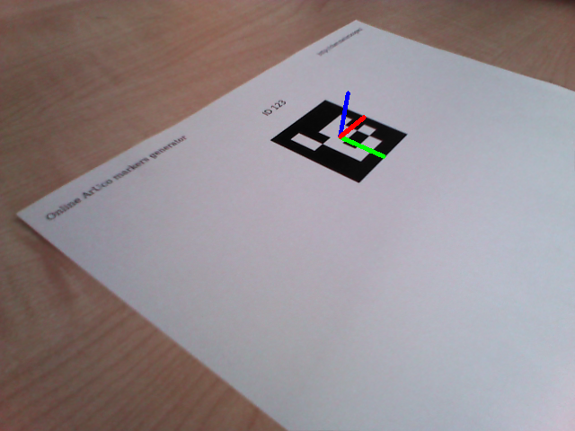
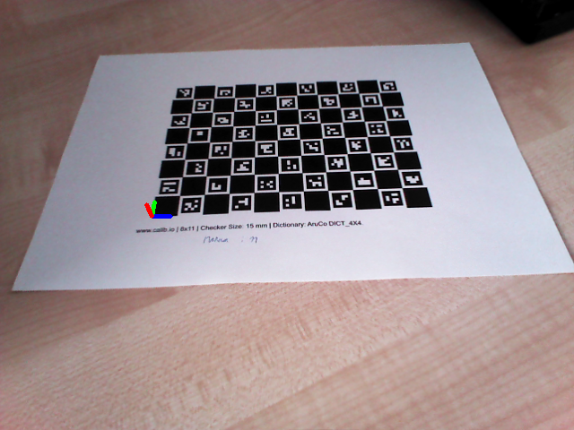

# easy_aruco

This package provides Yet Another Wrapper for the [ArUco library](https://www.uco.es/investiga/grupos/ava/node/26), in particular 
for the version [integrated into OpenCV 3.1+](https://docs.opencv.org/3.1.0/d9/d6a/group__aruco.html). It includes:
- scripts to generate ArUco markers or ChArUco boards with given physical dimensions
- a node for tracking individual ArUco markers
- a node for tracking a ChArUco board (usually more stable and reliable than a marker)

The pose of each tracked object is published on tf. It is possible to publish the pose of each object with respect to an arbitrary 
reference frame which is parent of the camera frame, as required by common hand-eye calibration setups 
(for example see the related package [easy_handeye](https://github.com/IFL-CAMP/easy_handeye)).

ArUco marker             |  ChArUco board
:-------------------------:|:-------------------------:
  |  

## Getting started
 
- make sure that your camera is calibrated! RGB-D cameras usually provide decent factory calibrations through the respective 
ROS driver, but RGB cameras such as webcams will require you to perform 
an [intrinsic calibration](http://wiki.ros.org/camera_calibration/Tutorials/MonocularCalibration). 

- check out this repository into your catkin workspace:
```bash
# create a new workspace if needed
source /opt/ros/$ROSDISTRO/devel/setup.bash
mkdir -p catkin_ws/src
cd catkin_ws/src

# install script dependencies
# 18.04/Melodic
pip install --user fpdf opencv-contrib-python
# 20.04/Noetic
pip3 install --user fpdf

# check out the repository, satisfy the dependencies and build
git clone https://github.com/marcoesposito1988/easy_aruco
cd ..
rosdep install -yir --from-paths src
catkin build
source devel/setup.bash
```

- generate a ChArUco board (or download the result of this command [here](docs/data/board_7x9_sq24_mk16_DICT_6x6_250.pdf)):
```bash
# example parameters: 5x7 chessboard, squares 40mm and markers 20mm big
rosrun easy_aruco create_charuco_board.py --dictionary  DICT_6X6_250 --squares_x 7 --squares_y 9 --square_size 24 --marker_size 16 --output_path ~/charuco_board.pdf
```

- print the PDF making sure that the rescaling option (also called sometimes 'Fit to size' or 'Auto shrink') is DISABLED

- __CHECK WITH A RULER THAT THE PHYSICAL DIMENSION OF THE MARKER CORRESPONDS TO WHAT YOU PROVIDED IN MILLIMETERS AS ARGUMENT TO THE SCRIPT__

- start your ROS camera driver, for example the Orbbec ASTRA:
```bash
roslaunch astra_camera astra.launch
```

- start the marker tracking, specifying the parameters of the marker and the namespace of the topics generated by the ROS camera 
driver (in the Orbbec case, `/camera/rgb/camera_info` for the calibration and `/camera/rgb/image_rect_color` for the rectified 
color image; for a driver respecting the standard, it suffices to provide the root namespace `/camera/rgb/`):
```bash
roslaunch easy_aruco track_charuco_board.launch camera_namespace:=/camera/rgb dictionary:=DICT_6X6_250 square_number_x:=7 square_number_y:=9 square_size:=0.024 marker_size:=0.016
```

- the pose of the board is now available in tf

